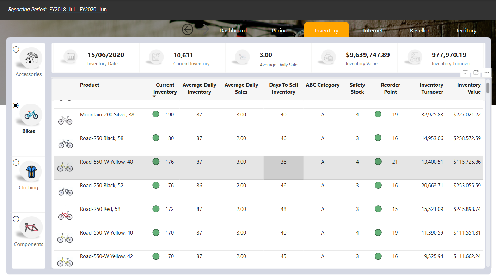

# Adventureworks
## Source:
Advanced DAX Calculations in Power BI Desktop: [Power BI Data Analyst](https://microsoftlearning.github.io/PL-300-Microsoft-Power-BI-Data-Analyst/Instructions/Labs/05-create-dax-calculations-in-power-bi-desktop-advanced.html)

DAX Calculations in Power BI Desktop: [Power BI Data Analyst](https://microsoftlearning.github.io/PL-300-Microsoft-Power-BI-Data-Analyst/Instructions/Labs/04-create-dax-calculations-in-power-bi-desktop.html)

Data Model in Power BI: [Power BI Data Analyst](https://microsoftlearning.github.io/PL-300-Microsoft-Power-BI-Data-Analyst/Instructions/Labs/03-configure-data-model-in-power-bi-desktop.html)

Worthy Tutorials: [Next Level Power BI Reports](https://www.youtube.com/@nextlevelpowerbireports)
               , [excelisfun](https://www.youtube.com/@excelisfun)
               , [Your Own KPI](https://www.youtube.com/@yourownkpi)
               , and [Get started with Microsoft data analytics](https://learn.microsoft.com/en-us/training/paths/data-analytics-microsoft/)
## Introduction
An improvement of skills since [PowerBI-Northwind-Traders](https://github.com/felixocham/PowerBI-Northwind-Traders/edit/master/README.md).
It covers in-depth analysis and visualisation of the company's stock, and analyses monthly customer trends.
## Analysis Steps
1. Creating necessary views.
2. Importing the data using Power Query (Calculated necessary columns and dropped unnecessary columns)
3. Loading the data into Power BI
4. Modelling the data in Power BI
5. Creating and testing the measures necessary for analysis
6. Designing icons and page Backgrounds in PowerPoint.
7. Creating visuals.
#### Outcome:

### Why I Picked This Dataset
Although businesses focus on making profits, stock management plays a huge role in closing sales that result in the said profits.
I was curious about the health of the company's stock, with a focus on overstocking, understocking, and stock sustainability versus the sales made and sales prospects.
## Thinking Process
1. How many units were sold?
2. What were the gross sales over the entire reporting period?
3. How do the online vs resellers sales compare?
4. What is the global distribution of online sales?
5. What are the global online gross sales?
6. Which was the top-selling product online per month?
7. Which was the top-selling product per reseller per month?
8. What is the global performance of resellers per business type?
9. What is the sales forecast for the next quarter?
10. How did the business perform in different regions?
11. How did the business perform in the various product categories (Units sold, Gross Sales, Cost of Goods, and Profits)?
12. Which were the best-selling products?
13. Which were the top-performing countries?
14. Which are the most recent Orders?
15. Who are the top-performing Salespeople?
16. Are there any sales seasons in the reporting period?
17. How is the business performing on a month-over-month and year-over-year basis?
18. Which are the best and worst-performing quarters?
19. What is the current stock?
20. What is the daily stock?
21. How many units per item were sold daily?
22. How long will the stocks last, given the current sales performance?
23. Are there any high-priority stock items?
24. What is the safety stock per item?
25. What is the stock reorder level per item?
26. Are there any items needing a reorder?
27. What is the stock turnover?
28. What is the stock value?
29. Are there any overstocked or understocked items?
30. How are the items performing per country?
31. Are there any high-value customers? If yes, what is the largest order, and the latest order?
32. What is the customers' growth trend?
33. How do new customers compare to repeat customers?
34. What is the business performance by territory?
35. What is the performance per category per territory per month?
36. Which was the best-performing product per territory per category?
